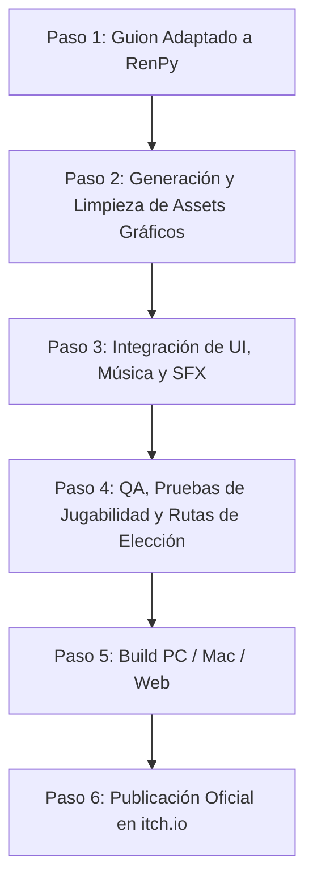

# Programa de Producción — Fase 1: Demo Debut en itch.io
## Corazones en Ebullición (Caps. 1 al 5)

Este documento establece el plan integral de producción técnica, gráfica, sonora y editorial para el lanzamiento de la **Demo Oficial (Fase 1)** de *Corazones en Ebullición* en la plataforma **itch.io**.

---

## 1. Ficha Técnica de la Demo

* **Título:** *Corazones en Ebullición* (Demo Prólogo)
* **Contenido narrativo:** Tronco Común — Capítulos 1 al 5 completos.
* **Extensión de texto:** ~36,244 palabras (35 escenas interactivas).
* **Duración estimada de juego:** 2.0 a 2.5 horas.
* **Público objetivo:** Novela visual narrativa / romance seinen / gastronomía y drama psicológico (18+).
* **Plataformas de destino:** Windows, macOS, Linux y versión Web (HTML5 jugable directamente en el navegador de itch.io).
* **Motor recomendado:** **Ren'Py 8.x** (permite compilación nativa en PC y exportación WebAssembly directa para itch.io).

---

## 2. Estructura Narrativa y Elecciones (Capítulos 1 al 5)

La Demo cubre la llegada de los cinco protagonistas a Sakura-machi y culmina con el pacto de convivencia:

| Capítulo | Título | Foco Narrativo | Escenas | Elecciones Clave |
| :--- | :--- | :--- | :--- | :--- |
| **Cap. 1** | *El Nuevo Comienzo* | Hiroshi llega a Sakura-machi, renta el local de los Yamamoto a la Sra. Tanaka y planta la semilla del taller. | 1.1 – 1.5 | • Elección 1: Filosofía ante el pueblo. • Elección 2: Enfoque de cocina (tradición vs. evolución vs. comunidad). |
| **Cap. 2** | *Primera Llegada* | **Llegada de Yuki:** Empapada bajo la lluvia; primeros intercambios de técnica, la sopa de miso y el trauma de Tokio. | 2.1 – 2.5 | • Elección 1: Empatía ante su silencio. • Elección 2: Probar su sopa de miso. • Elección 3: Aceptarla como alumna/asistente. |
| **Cap. 3** | *Energía Nueva* | **Llegada de Mika:** Torbellino pop, maleta rosa, lección de onigiri con Yuki, y vulnerabilidad solitaria en el parque. | 3.1 – 3.5 | • Elección 1: Reacción ante su desparpajo. • Elección 2: Equilibrio en el onigiri. • Elección 3: Apoyo emocional en el parque. |
| **Cap. 4** | *Completando el Grupo* | **Llegada de Ren y Saki:** Discusión en el taxi, choque de actitudes, inspección del taller y prueba culinaria. | 4.1 – 4.5 | • Elección 1: Credenciales de Hiroshi. • Elección 2: Desafío de cocina de Ren. • Elección 3: Dinámica nocturna de gratitud. |
| **Cap. 5** | *Rutinas y Ritmos* | **El clímax de la convivencia:** Primeras jornadas juntos, momentos íntimos a solas con cada una y **el pacto de los cinco**. | 5.1 – 5.11 | • Elección 1: Apoyo a Yuki en el mercado. • Elección 2: Cocina creativa con Mika. • Elección 3: Trabajo de fuerza con Ren. • Elección 4: El té a solas con Saki. • Elección 5: Voto en la asamblea del pacto. |

---

## 3. Pipeline de Assets Gráficos Necesarios

Para que la demo luzca profesional y visualmente impactante, se requiere el siguiente inventario visual:

### 3.1. Sprites de Personajes (Resolución 1080x1920 transparente)

Cada personaje cuenta con su vestimenta canónica definida y un set básico de **5 expresiones**:

1. **Yuki Hayashi:**
   * *Outfit:* Chaqueta cruzada de chef blanca, delantal azul marino a la cintura, trenza lateral suave sobre hombro en negro azulado con flequillo ligero (*see-through bangs*), ojos azul zafiro.
   * *Expresiones:* Neutral tímida, Concentrada/profesional, Sonrojada/vulnerable, Triste/avergonzada, Sonrisa sutil pura.
2. **Mika Nakamura:**
   * *Outfit:* Crop top gal translúcido, sports bra rosa fucsia visible debajo, jeans de mezclilla desgastados, coleta alta esponjosa castaño caramelo, ojos avellana, pecas.
   * *Expresiones:* Sonrisa radiante abierta, Guiño pícaro (*wink*), Sorprendida/cómica, Melancólica/sincera, Avergonzada/puchero.
3. **Ren Takahashi:**
   * *Outfit:* Top negro ajustado acanalado de tirantes, delantal de cuero marrón, pantalones entallados verde oliva, botines negros, corte Wolf Cut en capas castaño espresso.
   * *Expresiones:* Desafiante con ceño fruncido, Media sonrisa coqueta (*smirk*), Exasperada/cruzando brazos, Sorprendida con rubor en piel canela, Determinada/fuerte.
4. **Saki Yamamoto:**
   * *Outfit:* Camisa tradicional azul añil, falda casual fluida, moño bajo elegante con horquilla *kanzashi* de madera, ojos almendrados oscuros, busto natural armónico.
   * *Expresiones:* Sonrisa serena sabia, Paciente/atenta, Mirada penetrante de té, Conmovida/tierna, Solemne/matriarcal.
5. **Personajes Secundarios (Retratos o Sprites simples):**
   * Señora Sato (anciana del bastón).
   * Señora Tanaka (dueña del mercado y casera).

---

### 3.2. Fondos Clave (Backgrounds 1920x1080)

1. `bg_estacion_autobus_dia`: Parada rural desierta de Sakura-machi con niebla y bosque de fondo.
2. `bg_calle_principal`: Calle empedrada con fachadas tradicionales de madera y contraventanas cerradas.
3. `bg_mercado_tanaka`: Interior cálido, estantes de madera con frascos de conservas, arroz y miso.
4. `bg_taller_exterior`: Fachada de madera del taller con puerta acristalada y alero.
5. `bg_taller_cocina`: Gran cocina con barra de hinoki, estufas industriales y luz entrando por ventanales.
6. `bg_taller_lluvia`: La misma cocina pero con iluminación gris y gotas resbalando por los cristales (Cap. 2).
7. `bg_parque_banco`: Banco de madera bajo el cerezo invernal donde Mika descansa (Cap. 3).
8. `bg_comedor_noche`: Mesa baja corrida iluminada por lámpara cálida para la cena de convivencia (Cap. 4 y 5).

---

### 3.3. Event CGs Ilustradas (Ilustraciones de Impacto a Pantalla Completa)

Se sugieren 4 CGs de alto valor emocional para dejar huella en la demo:

* **CG 1 (Capítulo 2.1):** *Yuki bajo la lluvia en el umbral.* La chaqueta mojada translúcida, el encaje floral rojo asomando sutilmente, la trenza lateral goteando y sus ojos zafiro mirándote con timidez.
* **CG 2 (Capítulo 3.1):** *Mika asomada a la ventana.* Mika con las manos en el cristal haciendo visera, estirando su cintura y abdomen bajo el crop top con su radiante sonrisa gal.
* **CG 3 (Capítulo 4.1):** *La entrada de Ren y Saki.* Ren plantada con sus botines y delantal de cuero inspeccionando el espacio con mirada desafiante, mientras Saki a su lado se inclina con compostura serena.
* **CG 4 (Capítulo 5.11):** *El brindis del pacto.* Los cinco sentados alrededor de la mesa con los platos servidos, manos entrelazadas y miradas de complicidad marcando el inicio de la familia comunal.

---

## 4. Diseño Sonoro y Música (BGM & SFX)

* **BGM 1 (Tema Principal / Pueblo):** Guitarra acústica suave con piano lento y sutiles cuerdas tradicionales (melancólica pero esperanzadora).
* **BGM 2 (Cocina / Trabajo diario):** Ritmo acústico medio, ligero y positivo (*slice of life* relajante).
* **BGM 3 (Tema de Mika):** Ukelele alegre con percusión ligera pop acústica.
* **BGM 4 (Tema de Ren):** Guitarra acústica con bajo rítmico firme, enérgica y desafiante.
* **BGM 5 (Tema de Saki):** Koto tradicional suave, flauta de bambú (*shakuhachi*) y vientos lentos.
* **BGM 6 (Intimidad / Noche):** Piano solo minimalista con reverberación cálida para los monólogos interiores de Hiroshi.

---

## 5. Estrategia de Lanzamiento en itch.io

### 5.1. Datos de la Página de itch.io
* **Nombre de Proyecto:** `corazones-en-ebullicion-demo`
* **Cover Image (630x500):** Ilustración del Key Visual de las cuatro heroínas juntas (utilizando el prompt grupal ya definido).
* **Banner de Encabezado (960x400):** Fondo panorámico del obrador bañado en luz dorada matinal con el logo caligráfico.
* **Pricing:** *Free / Name your own price* (Gratis con opción de donación para quienes quieran apoyar el desarrollo).
* **Llamadas a la acción (CTA):**
  * Enlace al Discord de la comunidad / canal de feedback.
  * Botón para añadir a la lista de deseados (*Wishlist*) en Steam (si la página de Steam ya está activa).
  * Formulario de reporte de bugs y sugerencias.

### 5.2. Sinopsis para itch.io (Copywriting)

> **Un chef quebrado. Cuatro mujeres con heridas que no cierran. Y una cocina que se niega a morir.**
>
> Huyendo de la culpa y de las cenizas de un restaurante de tres estrellas en Tokio, Hiroshi Matsuda se refugia en Sakura-machi, un pueblo montañoso al borde de la extinción. Lo que comienza como un intento desesperado por volver a cocinar sin miedo se transforma cuando la lluvia y los autobuses traen hasta su puerta a cuatro almas singulares: una joven prodigio atrapada por el perfeccionismo, una creadora de contenido que oculta un luto tras su sonrisa radiante, una chef de forja de carácter indomable y la sabia heredera de una estirpe en bancarrota.
>
> En esta demo de prólogo (**Capítulos 1 al 5**), experimenta el nacimiento de su hogar comunal, descubre los secretos que esconden sus recetas y siente los primeros roces de una atracción que desafiará todas las reglas.
>
> * **Características:**
>   * Más de 35,000 palabras de narrativa rica, íntima y sensual.
>   * 4 heroínas con personalidades, anatomías y caminos emocionales únicos.
>   * Sistema de decisiones con impacto en el afecto de cada chica.
>   * Arte original con diseño de personajes distintivo y fondos inmersivos.

---

## 6. Cronograma de Ejecución (Paso a Paso)

1. **Paso 1 (Guion a Ren'Py):** Convertir el texto pulido de los capítulos 1 al 5 en bloques `.rpy` con comandos de diálogo, elecciones con variables de afecto (`yuki_points`, `mika_points`, etc.) y transiciones.
2. **Paso 2 (Generación de Assets):** Generar los sprites con transparencias (usando Stable Diffusion con los prompts calibrados), fondos de los escenarios y las 4 CGs.
3. **Paso 3 (Integración Multimedia):** Montar el tema musical principal, fondos, efectos de sonido de cocina y diseñar la interfaz de usuario (cuadro de diálogo, menú principal, guardado/carga).
4. **Paso 4 (Control de Calidad):** Comprobar que todas las ramificaciones de elecciones funcionen sin errores y que los textos se lean fluidos en pantalla.
5. **Paso 5 (Compilación y Build):** Generar los ejecutables para Windows, Mac, Linux y la versión WebAssembly para jugar en el navegador.
6. **Paso 6 (Publicación):** Subir la página a itch.io, configurar tags (`visual-novel`, `romance`, `anime`, `cooking`, `slice-of-life`, `interactive-fiction`) y abrir la recepción de feedback.
